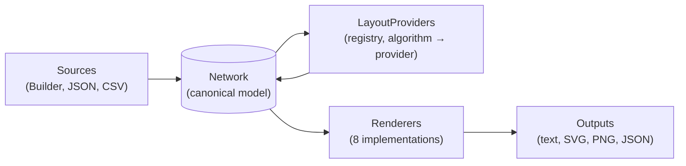

# Architecture

The toolkit's design is built around a single principle: **one canonical Network model, many output projections**. Everything else is consequence.

## The mental model



- **One canonical Network model** — the `Network` record in Core. Immutable, validated at construction, the single source of truth.
- **One canonical JSON envelope** — `NetworkJsonSerializer` produces and consumes one shape. This is what `NetworkImporter.FromJson` reads and what `CoreJsonRenderer` emits. There is no "D3 JSON" or "Cytoscape JSON" inside the system — those are *output projections* the relevant renderers produce on the way out.
- **N renderers** — each one knows how to project a `Network` into a specific consumer's expected shape (Mermaid syntax, ReactFlow JSON, Sigma's Graphology format, raw PNG, …). Renderers are independent; you can ship a new one without touching anything else.
- **N layout providers** — each one knows how to assign positions. They live in a registry keyed by `LayoutAlgorithm` so adapters (e.g. MSAGL) can plug in without Core knowing about them.

The intentional asymmetry between input and output: **N renderers** because users consciously *choose* their viz library; **only 2 importers** (JSON + CSV) because users don't choose a file format — they have data in some shape and have to map it. We document one shape (Core JSON) and let callers map to it.

## The plugin pattern

Adding a new renderer is purely additive. No edits to Core, no edits to the demo:

1. New csproj with one renderer class
2. The renderer exposes a `static RendererMetadata Metadata`
3. A `ServiceCollectionExtensions.AddXyzRenderer()` adds the renderer to DI *and* registers a `RendererDescriptor`
4. The demo host's auto-discovery loop iterates `app.Services.GetServices<RendererDescriptor>()` and registers a `GET /api/samples/{name}/{formatId}` endpoint per descriptor

The contract that makes this work is `RendererDescriptor` — a framework-neutral wrapper that knows its own `MimeType`, has a `Render(Network, IServiceProvider) → RendererOutput` method, and lives in Core (depends only on `Microsoft.Extensions.DependencyInjection.Abstractions`, *not* ASP.NET). The demo translates `RendererOutput` to ASP.NET `IResult` at the edge.

This is the same pattern used for layout providers — `LayoutProviders.Register(algorithm, factory)` lets the MSAGL adapter contribute its Sugiyama/MDS providers without Core taking a dependency on MSAGL.

## Project layout

```
src/DeepSigma.NetworkVisualization.Core
    ├── Network, Node, Edge, Group, Color, Position …      ← canonical model
    ├── Builders/                                          ← fluent NetworkBuilder + sub-builders
    ├── Json/NetworkJsonSerializer                         ← canonical JSON envelope
    ├── Layouts/                                           ← built-in providers + LayoutProviders registry
    └── Rendering/
        ├── INetworkRenderer<TOutput>                      ← renderer interface
        ├── IJsonNetworkRenderer                           ← marker for JSON-emitting renderers
        ├── ILayoutProvider                                ← layout interface
        ├── RendererMetadata, RendererDescriptor           ← plugin metadata + descriptor
        ├── RenderResolutions                              ← style/size/label resolution helpers
        ├── CoreJsonRenderer                               ← canonical envelope renderer
        └── CoreJsonServiceCollectionExtensions

src/DeepSigma.NetworkVisualization.Layout.Msagl           ← MSAGL adapter, registers Sugiyama/MDS via MsaglLayouts.Register()
src/DeepSigma.NetworkVisualization.Importers              ← NetworkImporter facade + CsvImporter
src/DeepSigma.NetworkVisualization.Renderers.<Name>       ← one csproj per renderer; pattern repeats

samples/DeepSigma.NetworkVisualization.Samples            ← shared sample networks (consumed by demo + tests)
test/DeepSigma.NetworkVisualization.Tests                 ← xUnit v3
demo/DeepSigma.NetworkVisualization.Demo.Web              ← ASP.NET minimal API host
demo/demo-react                                            ← Vite + React frontend
aspire/DeepSigma.NetworkVisualization.AppHost             ← .NET Aspire orchestrator (API + Vite together)
```

Renderers live in their own package each so consumers pull only what they need. Core takes only `System.Text.Json` and `Microsoft.Extensions.DependencyInjection.Abstractions` — nothing else.

## Key contracts

### `Network` (Core, `Network.cs`)

The canonical model. Immutable. Fields: `Directed`, `Nodes`, `Edges`, `Groups`, `Layout`, `Interaction`, `Theme`, `Metadata`, `Title`.

### `NetworkJsonSerializer` (Core, `Json/`)

The one JSON envelope: `{ format: "deepsigma.network", version: "1.0", network: { … } }`. Colors emitted as `#rrggbbaa`, enums as PascalCase strings. Source-generated via `JsonSerializable` context for AOT and perf.

### `INetworkRenderer<TOutput>` (Core, `Rendering/`)

Two members: `string FormatId` and `TOutput Render(Network)`. Implementations choose their output type — `string` for text formats and JSON, `byte[]` for raster.

### `RendererDescriptor` (Core, `Rendering/`)

Carries `RendererMetadata` (FormatId, MimeType, RequiresLayout) plus a `Render(Network, IServiceProvider) → RendererOutput` method. `TextRendererDescriptor` and `BinaryRendererDescriptor` are the two concrete subclasses. The renderer instance is resolved from DI inside the closure passed at registration time.

### `RendererOutput` (Core, `Rendering/`)

Framework-neutral discriminator: `TextOutput(string, mime)` or `BinaryOutput(byte[], mime)`. Lets the descriptor live in Core (no ASP.NET dependency); the demo's endpoint handler matches on the type and produces the right `IResult`.

### `ILayoutProvider` + `LayoutProviders` registry (Core, `Layouts/`)

Providers implement `Network ApplyLayout(Network)`. The registry maps `LayoutAlgorithm` → factory function; `LayoutProviders.Register(algorithm, factory)` lets adapters override the default. `Network.EnsureLayout()` is the extension method renderers call when they need positions and the network doesn't have any.

### `NetworkImporter` (Importers, `NetworkImporter.cs`)

Two methods: `FromJson(string)` and `FromCsv(string, string)`. That's the entire public surface for inbound data. No format detection, no plugin pattern — by design.

## Decision log

A few opinionated calls worth recording:

- **Two importers, eight renderers** — explained in the mental-model section above. Briefly: users *choose* a viz library; they don't *choose* a source file format, they just have data. We document one shape and let callers map.
- **MSAGL as an opt-in adapter** — Core depends on no external native libs. MSAGL ships through a separate package; calling `MsaglLayouts.Register()` once at startup lets it transparently override the built-in Sugiyama/MDS factories in the `LayoutProviders` registry. Renderers don't know about MSAGL at all.
- **Core JSON ≠ renderer JSON** — every JSON-emitting renderer (ReactFlow, Cytoscape, D3, Sigma) emits its target ecosystem's expected shape, not our canonical envelope. The canonical envelope is for `CoreJsonRenderer` and `NetworkImporter.FromJson`. Internal-format ≠ wire-formats-to-consumers.
- **`RendererDescriptor` in Core, not in renderer packages** — keeps the framework-neutral descriptor + auto-discovery pattern usable by any host, not tied to the demo or to ASP.NET. The descriptor takes a `Func<IServiceProvider, Network, …>` so any DI container can resolve the renderer at call time.
- **Workspace JS deps via Vite alias, not pre-bundled** — `demo/demo-react/vite.config.ts` aliases `deepsigma-network-react` and `deepsigma-network-core` to their `src/` directories and excludes them from `optimizeDeps`. Edits in the workspace lib HMR directly into the demo without rebuilding `dist/` and clearing `.vite`.
- **Edit store in the demo, not in Core** — editing is a host concern. Core stays a pure model + renderers + layouts.
- **xUnit v3 + Microsoft Testing Platform** — tests run as an executable: `dotnet run --project test/…`. Avoids the VSTest host-resolution issues we hit early on.

## Coordinate systems

A note for renderer authors: positions are absolute, with Y growing *downward* (screen convention — matches SVG, Skia, ReactFlow). Sigma flips Y in its renderer (since Sigma's math convention is Y-up). Layout providers must respect screen convention.
