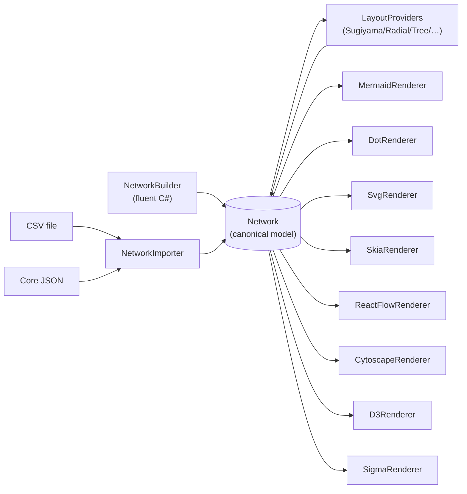

# DeepSigma.NetworkVisualization

A family of .NET packages and React components for rendering network/graph visualizations through swappable renderers. **One Network model, eight rendering targets, one consistent fluent API.**

```csharp
var network = NetworkBuilder.Create()
    .Directed()
    .Title("My Pipeline")
    .WithLayout(l => l.Sugiyama().Direction(LayoutDirection.LeftToRight))
    .AddNode("src",   n => n.Label("Source").Shape(NodeShape.Cylinder))
    .AddNode("build", n => n.Label("Build"))
    .AddNode("prod",  n => n.Label("Prod").Fill("#16A34A"))
    .AddEdge("src",   "build", e => e.Label("git"))
    .AddEdge("build", "prod",  e => e.Label("deploy").Dashed())
    .Build();

var mermaid    = new MermaidRenderer().Render(network);     // → flowchart text
var svg        = new SvgRenderer().Render(network);          // → SVG document
var reactFlow  = new ReactFlowRenderer().Render(network);    // → JSON for ReactFlow
var png        = new SkiaRenderer().Render(network);         // → PNG bytes
```

Swap renderers; the input is identical.

## What's in the box

| Renderer | Output | Engine |
| --- | --- | --- |
| **Mermaid** | flowchart text | (consumed by mermaid.js in the browser) |
| **GraphViz DOT** | DOT text | (consumed by @hpcc-js/wasm-graphviz in the browser) |
| **SVG** | SVG document | pure C# emitter |
| **SkiaSharp** | PNG / JPEG / WebP | SkiaSharp |
| **ReactFlow** | JSON | consumed by `reactflow` in React |
| **Cytoscape.js** | JSON | consumed by `cytoscape` (with dagre layout extension) |
| **D3 force-graph** | JSON | consumed by `d3` |
| **Sigma.js** | Graphology JSON | consumed by `sigma` + `graphology` (WebGL, large graphs) |

Plus a **`CoreJsonRenderer`** that emits the canonical Core JSON envelope — the same shape `NetworkImporter.FromJson` consumes.



## Repository layout

```
src/
├── DeepSigma.NetworkVisualization.Core               # types, fluent builder, JSON contract, layouts
├── DeepSigma.NetworkVisualization.Layout.Msagl       # MSAGL adapter (Sugiyama / MDS via NuGet)
├── DeepSigma.NetworkVisualization.Importers          # NetworkImporter.FromJson + FromCsv
├── DeepSigma.NetworkVisualization.Renderers.Mermaid
├── DeepSigma.NetworkVisualization.Renderers.Dot
├── DeepSigma.NetworkVisualization.Renderers.Svg
├── DeepSigma.NetworkVisualization.Renderers.SkiaSharp
├── DeepSigma.NetworkVisualization.Renderers.ReactFlow
├── DeepSigma.NetworkVisualization.Renderers.Cytoscape
├── DeepSigma.NetworkVisualization.Renderers.D3
├── DeepSigma.NetworkVisualization.Renderers.Sigma
└── js/
    ├── deepsigma-network-core                        # TypeScript types mirroring the JSON contract
    └── deepsigma-network-react                       # React components: ReactFlowNetwork, CytoscapeNetwork, D3Network, SigmaNetwork, MermaidNetwork, DotNetwork

samples/DeepSigma.NetworkVisualization.Samples        # OrgChart, Pipeline, SocialNetwork, Clusters, RadialTaxonomy
test/DeepSigma.NetworkVisualization.Tests             # xUnit v3
demo/DeepSigma.NetworkVisualization.Demo.Web          # ASP.NET minimal API host
demo/demo-react                                        # Vite + React frontend (interactive viewer + editor + import UI)
aspire/DeepSigma.NetworkVisualization.AppHost         # .NET Aspire orchestrator
```

## Running the demo

```bash
npm install                                                       # one-time JS deps
dotnet run --project aspire/DeepSigma.NetworkVisualization.AppHost --launch-profile http
```

That single command starts:

| URL                       | Resource                                                  |
| ------------------------- | --------------------------------------------------------- |
| http://localhost:15080    | Aspire dashboard (resources, logs, traces)                |
| http://localhost:5180     | ASP.NET API (auto-discovers every registered renderer)    |
| http://localhost:5173     | Vite dev server with HMR — open this for the demo         |

The demo includes:
- **5 sample networks** (Org Chart, CI/CD Pipeline, Social Network, Service Topology, Knowledge Taxonomy)
- **9 view tabs** per sample (ReactFlow / Cytoscape.js / D3 / Sigma.js / Mermaid / GraphViz DOT / SVG / PNG / Core JSON)
- **Interactive selection** — click any node in an interactive renderer; the sidebar shows its data payload
- **Theme toggle** — light/dark, switches the entire render server-side
- **Editor mode** — add/move/delete nodes, drag-to-connect edges; saves persist across all renderers via an in-memory edit store
- **Import** — paste Core JSON or CSV, get an `imported` virtual sample renderable in every viz

## Quick start (library)

```csharp
using DeepSigma.NetworkVisualization;
using DeepSigma.NetworkVisualization.Builders;
using DeepSigma.NetworkVisualization.Renderers.Mermaid;

var network = NetworkBuilder.Create()
    .Directed()
    .AddNode("a", n => n.Label("Alice"))
    .AddNode("b", n => n.Label("Bob"))
    .AddEdge("a", "b", e => e.Label("knows"))
    .Build();

Console.WriteLine(new MermaidRenderer().Render(network));
```

For more recipes (every renderer, custom layouts, imports, registering new renderers, using the React components), see **[USAGE.md](USAGE.md)**.

## Adding your own renderer

Each renderer is a small package that ships its own DI extension. Adding a new one is one method, one extension, one demo line — the demo backend auto-discovers it via `IEnumerable<RendererDescriptor>` and registers an endpoint for it without any other changes.

```csharp
public sealed class MyRenderer : INetworkRenderer<string>
{
    public static RendererMetadata Metadata { get; } = new("myformat", "text/plain");
    public string FormatId => Metadata.FormatId;
    public string Render(Network network) { /* ... */ }
}

public static class MyServiceCollectionExtensions
{
    public static IServiceCollection AddMyRenderer(this IServiceCollection s)
    {
        s.AddSingleton<MyRenderer>();
        s.AddSingleton<RendererDescriptor>(new TextRendererDescriptor(
            MyRenderer.Metadata,
            (sp, net) => sp.GetRequiredService<MyRenderer>().Render(net)));
        return s;
    }
}

// In the host:
builder.Services.AddMyRenderer();
```

The demo will automatically expose `GET /api/samples/{name}/myformat`. See **[ARCHITECTURE.md](ARCHITECTURE.md)** for why this works.

## Importing data

```csharp
using DeepSigma.NetworkVisualization.Importers;

// 1) Core JSON envelope (what NetworkJsonSerializer.Serialize produces)
var net = NetworkImporter.FromJson(jsonString);

// 2) CSV — two strings, one per table
var net = NetworkImporter.FromCsv(
    nodesCsv: "id,label,color\na,Alice,#FF0000\nb,Bob,#00FF00",
    edgesCsv: "source,target,label\na,b,knows");
```

We deliberately don't ship importers for D3/Cytoscape/Graphology/Gephi JSON dialects. Real-world data usually arrives from a database, a domain object, or a custom format — the mapping is the caller's concern. **One documented JSON shape + CSV** covers the practical case without the maintenance burden of chasing every ecosystem's JSON variant.

## Running tests

xUnit v3 uses Microsoft Testing Platform — run the test project directly:

```bash
dotnet run --project test/DeepSigma.NetworkVisualization.Tests
```

## Demo backend endpoints

Every renderer is auto-discovered from DI; endpoint paths come from `RendererMetadata.FormatId`.

| Endpoint                                  | Returns                       |
| ----------------------------------------- | ----------------------------- |
| `GET /api/samples`                        | List of sample networks       |
| `GET /api/samples/{name}/core`            | Canonical Core JSON envelope  |
| `GET /api/samples/{name}/mermaid`         | Mermaid flowchart text        |
| `GET /api/samples/{name}/dot`             | GraphViz DOT                  |
| `GET /api/samples/{name}/svg`             | SVG document                  |
| `GET /api/samples/{name}/png`             | PNG (SkiaSharp)               |
| `GET /api/samples/{name}/reactflow`       | ReactFlow JSON                |
| `GET /api/samples/{name}/cytoscape`       | Cytoscape elements JSON       |
| `GET /api/samples/{name}/d3`              | D3 force-graph JSON           |
| `GET /api/samples/{name}/sigma`           | Graphology / Sigma.js JSON    |
| `GET /api/samples/{name}/{any}?theme=dark`| Same renderer, dark theme     |
| `POST /api/edit/{name}` body=Core JSON    | Persist an edited version     |
| `DELETE /api/edit/{name}`                 | Revert an edit                |
| `POST /api/import?format=json\|csv`        | Add a temporary virtual sample |

## License

MIT.
